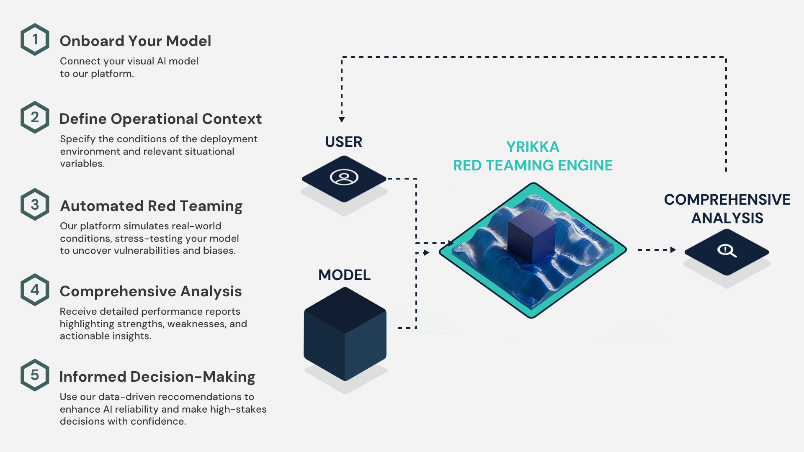

# Adversarial Probing & Evaluation of Exploits (APEX): Automated Context-Based Object Detection Model Evaluation

This repository provides sample code and examples for using YRIKKA's APEX API - an automated context-based evaluation system for object detection models. APEX allows you to test your models in specific scenarios by describing the context in natural language.



**[🔑 Sign up for an APEX API key](https://apex.yrikka.com/login?client_id=3fn9ks2vmp3gdis9jvts464v31&response_type=code&scope=email+openid+phone&redirect_uri=https%3A%2F%2Fyrikka.com%2F)**

**[📚 View the complete API documentation](https://yrikka.github.io/apex-quickstart/)**

**[🌐 Visit YRIKKA](https://yrikka.com)**

## Quota Limits

Our initial release is free, allowing users to submit up to 8 jobs per day. After reaching this limit, further submissions will be denied. Please plan your usage accordingly.

## Table of Contents

- [What is APEX?](#what-is-apex)
- [Getting Started](#getting-started)
  - [1. Get an API Key](#1-get-an-api-key)
  - [2. Prepare Your Model Package](#2-prepare-your-model-package)
- [Model Package Structure](#model-package-structure)
  - [Required Files](#required-files)
  - [Example Implementation](#example-implementation)
  - [inference.py Requirements](#inferencepy-requirements)
  - [manifest.json Format](#manifestjson-format)
- [Supported Libraries](#supported-libraries)
- [Creating Effective Context Descriptions](#creating-effective-context-descriptions)
- [Using the API](#using-the-api)
  - [Step 1: Package Your Model](#step-1-package-your-model)
  - [Step 2: Get a Presigned URL](#step-2-get-a-presigned-url)
  - [Step 3: Upload Your Model](#step-3-upload-your-model)
  - [Step 4: Submit an Evaluation Job](#step-4-submit-an-evaluation-job)
  - [Step 5: Check Job Status and Get Results](#step-5-check-job-status-and-get-results)
- [Example Model Output](#example-model-output)
- [Troubleshooting](#troubleshooting)
- [Need Help?](#need-help)

## What is APEX?

APEX is a powerful evaluation platform that tests your object detection models in customizable contexts using synthetically generated data. Using just three inputs from you, APEX:

- Creates synthetic test images based on your natural language context descriptions
- Evaluates your model against these test images
- Provides detailed performance metrics across different scenarios
- Helps identify strengths and weaknesses in your models

All you need to provide is:
1. **Natural language descriptions** of the test contexts (e.g., "detect cherries in varying lighting conditions")
2. Your **model weights** file
3. A simple **inference script** implementing the required functions

No need to create test datasets manually - APEX handles the entire evaluation process automatically.

## Getting Started

### 1. Get an API Key

1. [Sign up for an APEX API key](https://apex.yrikka.com/login?client_id=3fn9ks2vmp3gdis9jvts464v31&response_type=code&scope=email+openid+phone&redirect_uri=https%3A%2F%2Fyrikka.com%2F)
2. Verify your email address
3. Check your email for your API key

### 2. Prepare Your Model Package

Your model package must include:

- **inference.py**: Script implementing the required inference functions
- **model weights**: Your trained model file (e.g., `model.pt`)
- **manifest.json**: Configuration file specifying entry points

This repository includes an example model package in the `examples/yolo_v9_tiny` directory.

## Model Package Structure

### Required Files

```
yolo_v9_tiny/
├── inference.py     # Implements required interface functions
├── model.pt         # Your model weights
└── manifest.json    # Configuration specifying entry points
```

> 📋 **Ready-to-Use Example**: Start with the `examples/yolo_v9_tiny` directory as your template! This working example can be easily adapted for your own models:
> 
> 1. Copy the entire `yolo_v9_tiny` directory and rename it for your project
> 2. Update the `CLASS_NAMES` dictionary in `inference.py` with your model's classes
> 3. Replace the model file with your own weights (keep the same name or update manifest.json)
> 4. Create a tarball of your directory following the instructions below
>
> This approach can be adapted for other object detection architectures with minimal changes to the inference functions.

### Example Implementation

The example implementation in this repository uses [YOLOv9-tiny](https://docs.ultralytics.com/models/yolov9/#performance-on-ms-coco-dataset), a lightweight version of YOLOv9 trained on the COCO dataset.

### inference.py Requirements

Your `inference.py` must include the following components:

#### 1. `CLASS_NAMES` Dictionary
You must define a dictionary mapping class indices to class names at the top of your script.

```python
# Define your class mapping - indices to human-readable class names
CLASS_NAMES = {
    0: 'person', 1: 'bicycle', 2: 'car',
    # ... other classes ...
    79: 'toothbrush'
}
```

#### 2. `model_fn(weights_file, device)`
Loads your model from the specified path and moves it to the specified device.

```python
def model_fn(weights_file: str, device: str = "cpu"):
    """
    Load the model from disk and move it to the specified device.
    
    Args:
        weights_file: Path to the model weights file
        device: Device to run the model on ("cpu" or "cuda")
        
    Returns:
        Loaded model object on the specified device
    """
    model = YOLO(weights_file)
    model.to(device)
    return model
```

#### 3. `input_fn(image, device, target_size)`
Prepares input for your model and handles device placement if needed.

```python
def input_fn(
    image: Image.Image, 
    device: str = "cpu",
    target_size: Tuple[int, int] = (640, 640)
) -> np.ndarray:
    """
    Preprocess the input image for model inference.
    
    Args:
        image: PIL.Image object
        device: Device to place the processed input on ("cpu" or "cuda")
        target_size: Target size for letterboxing. Defaults to (640, 640)
        
    Returns:
        Preprocessed image tensor ready for model inference
    """
    # Implementation details in example code
    return preprocessed_image
```

#### 4. `predict_fn(image_array, model)`
Runs inference using your model.

```python
def predict_fn(image_array: np.ndarray, model: YOLO) -> list:
    """
    Run model inference on the preprocessed input.
    
    Args:
        image_array: Output from input_fn
        model: Model object returned by model_fn
        
    Returns:
        Raw prediction results
    """
    return model(image_array)
```

#### 5. `output_fn(predictions, image, target_size)`
Formats the results in the required format.

```python
def output_fn(
    predictions: list,
    image: Image.Image,
    target_size: Tuple[int, int] = (640, 640)
) -> Tuple[np.ndarray, np.ndarray, np.ndarray]:
    """
    Post-process model predictions to required format.
    
    Args:
        predictions: Output from predict_fn
        image: Original input image
        target_size: Target size used for letterboxing
        
    Returns:
        tuple of (class_names, confidences, bounding_boxes):
          - class_names: np.ndarray[str] - Array of class name strings
          - confidences: np.ndarray[float] - Array of confidence scores
          - bounding_boxes: np.ndarray[float] with shape (N,4) containing [xmin, ymin, xmax, ymax]
    """
    # Implementation details in example code
    return cls, conf, boxes
```

### manifest.json Format

The `manifest.json` file specifies your entry points:

```json
{
    "entry_point": "inference.py",
    "model_file": "yolov9t.pt"
}
```

## Supported Libraries

Your `inference.py` script can use a wide range of preinstalled libraries commonly used for machine learning, deep learning, computer vision, and NLP.

### Deep Learning Frameworks

- PyTorch (2.4+) and Torchvision (0.19+)
- TensorFlow (2.19+) and Keras (3.x)
- PyTorch Lightning (2.x)
- Support for model libraries such as Timm, YOLOv8, and EfficientNet

### Transformers & NLP

- Hugging Face Transformers (4.37+) and Datasets (2.19+)
- Tokenization tools: tokenizers, sentencepiece

### Traditional ML & Statistics

- Scikit-learn (1.3+), Statsmodels (0.14)

### Computer Vision

- OpenCV (4.8+), albumentations, scikit-image, Pillow, pycocotools, imageio

### Data & Evaluation Utilities

- numpy, pandas, scipy, matplotlib, seaborn
- umap-learn, torchmetrics, fiftyone

⚡ **Note**: The current public API runs in a container based on CUDA 12.1, optimized for GPU-accelerated inference using PyTorch and TensorFlow.

🙋‍♀️ **Don't see a package you need?** No problem — contact us to learn about getting your own private API environment with custom dependencies.

## Creating Effective Context Descriptions

When submitting an evaluation job, the `context_description` parameter is crucial as it determines what scenarios your model will be tested in. Here are guidelines for creating effective context descriptions:

#### Best Practices

- **Be specific and detailed** about the environments where your model will be deployed
- Include information about **lighting conditions** (bright sunlight, dim indoor, night, etc.)
- Specify **background variations** that might be present (foliage, urban settings, etc.)
- Mention **object variations** (size, color, orientation, partial occlusion)
- Describe **camera angles** and distances that are relevant
- Include **weather conditions** if applicable (rain, fog, snow)

#### Examples

**Basic description:**
```
"Test my cherry detection model."
```

**Improved description:**
```
"Evaluate cherry detection in outdoor orchards with varying lighting conditions including direct sunlight, overcast, and dawn/dusk. Include scenarios with cherries partially hidden by leaves, different stages of ripeness, and multiple viewing angles. Test with both close-up and distant views of cherry clusters."
```

The more specific your description, the more targeted and valuable your evaluation results will be.

## Using the API

Once you have created your inference script and prepared your model files, you'll need to follow these steps to evaluate your model with APEX. A full example implementation is provided in the `demo.py` file in this repository. Below, we break down each step:

### Step 1: Package Your Model

> ⚠️ **IMPORTANT**: Your model package tarball must be less than 4GB in size.

Create a tarball of your model directory:

```python
import os
import tarfile

def create_tarball(directory, output_file):
    with tarfile.open(output_file, "w:gz") as tar:
        tar.add(directory, arcname=os.path.basename(directory))
    print(f"Created tarball '{output_file}' from directory '{directory}'")

# Usage
MODEL_DIR = "my_model_package"
TARBALL_PATH = "model_package.tar.gz"
create_tarball(MODEL_DIR, TARBALL_PATH)
```

### Step 2: Get a Presigned URL

Request a presigned URL to upload your model:

```python
import requests

def get_presigned_url(api_key):
    headers = {"x-api-key": api_key, "Content-Type": "application/json"}
    response = requests.get("https://api.yrikka.com/v1/presigned", headers=headers)
    response.raise_for_status()
    return response.json()["upload_url"], response.json()["s3_uri"]

# Usage
API_KEY = "your_api_key_here"
upload_url, s3_uri = get_presigned_url(API_KEY)
```

### Step 3: Upload Your Model

Upload your tarball to the presigned URL:

```python
def upload_tarball(upload_url, file_path):
    with open(file_path, "rb") as f:
        response = requests.put(upload_url, data=f)
    response.raise_for_status()

# Usage
upload_tarball(upload_url, TARBALL_PATH)
```

#### Alternative: Using AWS CLI

If you prefer using command-line tools:

```bash
# Direct upload with curl
curl -X PUT -T model_package.tar.gz "PRESIGNED_URL_HERE"

# Or with AWS CLI (also using the presigned URL)
aws s3 cp model_package.tar.gz "PRESIGNED_URL_HERE"
```

### Step 4: Submit an Evaluation Job

Once you have uploaded a model, you may submit a job with your desired context:

```python
def submit_job(api_key, model_package_uri, target_classes, context_description):
    headers = {"x-api-key": api_key, "Content-Type": "application/json"}
    data = {
        "s3_model_package_uri": model_package_uri,
        "target_classes": target_classes,
        "context_description": context_description
    }
    response = requests.post("https://api.yrikka.com/v1/submit-job", headers=headers, json=data)
    response.raise_for_status()
    return response.json()["job_id"]

# Usage
target_classes = ["snowboard", "skateboard", "frisbee"]
context = (
    "Test the Yolo v9 Tiny model at skate parks, snow resorts, and public parks "
    "during different times of day and weather conditions. Generate test scenarios "
    "with people actively using the equipment as well as scenes where multiple "
    "objects are scattered around at various distances from the camera."
)
job_id = submit_job(API_KEY, s3_uri, target_classes, context)
```

#### API Parameters Explained

- **s3_model_package_uri**: The S3 URI returned from the presigned URL response, which identifies your uploaded model package
- **target_classes**: Array of class names that your model should be tested on. Must be a subset of the names in the CLASS_NAMES dictionary from your inference.py
- **context_description**: Natural language description of the contexts where you want your model evaluated (see below)

### Step 5: Check Job Status and Get Results

Monitor the job status and retrieve results when complete:

> ⏱️ **Processing Time Note**: APEX creates custom test images and thoroughly evaluates your model against them in various contexts, which can take time (typically 20-60 minutes depending on model complexity). Rather than using the polling approach shown below, you may want to implement your own logic to check status at longer intervals or build a notification system.

```python
import time

def check_job_status(api_key, job_id):
    headers = {"x-api-key": api_key}
    while True:
        response = requests.get(
            "https://api.yrikka.com/v1/job-status", 
            headers=headers, 
            params={"job_id": job_id}
        )
        
        response_data = response.json()
        status = response_data.get("status")
        message = response_data.get("message")
                
        if status == "SUCCESS":
            print("Evaluation completed!")
            return response_data.get("results") # Return evaluation metrics
        elif status in ["FAIL", "ERROR"]:
            print(f"Job failed: {message}")
            return None
            
        print("Still processing, checking again in 5 minutes...")
        time.sleep(300)

# Usage
results = check_job_status(API_KEY, job_id)
if results:
    # Print the complete results object - structure may change over time
    print("Results:", results)
```

## Example Response

When using the `/job-status` endpoint with a completed job, you'll receive a response like:

```json
{
  "status": "SUCCESS",
  "results": {
    "Aggregate": {
      "Precision": 0.812,
      "Recall": 0.519,
      "F1-score": 0.629
    },
    "Granular": [
      {
        "Category": "time of day",
        "Items": [
          {
            "Context": "night",
            "Precision": 0.786,
            "Recall": 0.574,
            "F1-Score": 0.644
          }
        ]
      },
      {
        "Category": "environment",
        "Items": [
          {
            "Context": "snow resort",
            "Precision": 0.817,
            "Recall": 0.391,
            "F1-Score": 0.529
          }
        ]
      }
    ]
  }
}
```

The response includes:
- **Aggregate metrics** across all test scenarios
- **Granular results** broken down by different contexts
  
Each category contains detailed metrics for specific contexts, helping you understand how your model performs in different scenarios.

## Troubleshooting

Common issues and solutions:

- **Missing functions**: Ensure inference.py implements all required functions
- **Class mapping**: Ensure your CLASS_NAMES includes all target_classes
- **Size limits**: Keep your model package under 4GB (packages larger than 4GB will be rejected)
- **Device parameters**: Make sure to correctly implement the `device` parameter in both `model_fn` and `input_fn` functions
- **Model movement**: Ensure your model is properly moved to the specified device using `.to(device)` for PyTorch models during model loading

## Need Help?

- API Documentation: [APEX API Documentation](https://docs.yrikka.com/apex)
- Contact Support: help@yrikka.com

## API Documentation

Our API documentation is available at [https://yrikka.github.io/apex-quickstart/](https://yrikka.github.io/apex-quickstart/)
