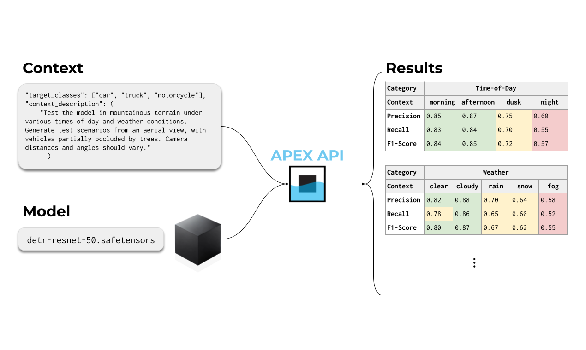

# APEX: Automated Context-Based Object Detection Model Evaluation

APEX is a powerful API for evaluating object detection models in customizable contexts using synthetically generated data. Simply describe your test scenarios in natural language, and APEX will:

- Generate synthetic test images matching your descriptions
- Evaluate your model against these images
- Provide detailed performance metrics



## Quick Links

**[🔑 Get API Key](https://apex.yrikka.com/login?client_id=3fn9ks2vmp3gdis9jvts464v31&response_type=code&scope=email+openid+phone&redirect_uri=https%3A%2F%2Fyrikka.com%2F)**

**[📚 API Documentation](https://yrikka.github.io/apex-quickstart/)**

**[🌐 Visit YRIKKA](https://yrikka.com)**

## Getting Started

### 1. Prepare Your Model
First, package your model following our [Model Package Guide](docs/README.md). The guide explains how to:
- Structure your model package
- Implement the required inference functions
- Configure your manifest.json

### 2. Use the API

The API workflow consists of three main steps:

1. **Get Upload URL** (`GET /v1/presigned`)
   - Request a pre-signed URL to securely upload your model package
   - Returns an upload URL and a model package URI for later use

2. **Submit Evaluation Job** (`POST /v1/submit-job`)
   - Submit your model package URI with target classes and context description
   - Returns a job ID for tracking progress

3. **Check Job Status** (`GET /v1/job-status`)
   - Monitor job progress using your job ID
   - Retrieve evaluation results when complete

We provide two resources with complete implementations:

- **[Demo Script](demo.py)**: Complete implementation showing how to package, upload, and evaluate your model
- **[Interactive Notebook](notebooks/agtech_example.ipynb)**: Step-by-step guide with detailed explanations

## Creating Effective Context Descriptions

Your context description determines what scenarios your model will be tested in. Example contexts include:

- **Environments** (indoor/outdoor, urban/rural)
- **Lighting conditions** (bright, dim, night)
- **Weather** (clear, rain, snow)
- **Camera angles** and distances
- **Object variations** (size, orientation, occlusion)

Example:
```
"Evaluate cherry detection in outdoor orchards with varying lighting conditions 
including direct sunlight, overcast, and dawn/dusk. Include scenarios with 
cherries partially hidden by leaves, different stages of ripeness, and 
multiple viewing angles."
```

## Example Response

```json
{
  "status": "SUCCESS",
  "results": {
    "Aggregate": {
      "Precision": 0.812,
      "Recall": 0.519,
      "F1-score": 0.629
    },
    "Granular": [
      {
        "Category": "time of day",
        "Items": [
          {
            "Context": "night",
            "Precision": 0.786,
            "Recall": 0.574,
            "F1-Score": 0.644
          }
        ]
      },
      // ... additional categories (weather, distance, etc.) ...
    ]
  }
}
```

## Quota Limits

The free release of APEX includes a daily submission quota:
- **8 evaluation jobs per day** via the `/submit-job` endpoint
- When you reach this limit, job submissions will receive a `403 Forbidden` response

🙋‍♀️ **Need higher limits?** Contact us!

## Need Help?

- [Model Package Guide](docs/README.md)
- [API Documentation](https://yrikka.github.io/apex-quickstart/)
- Email: help@yrikka.com
